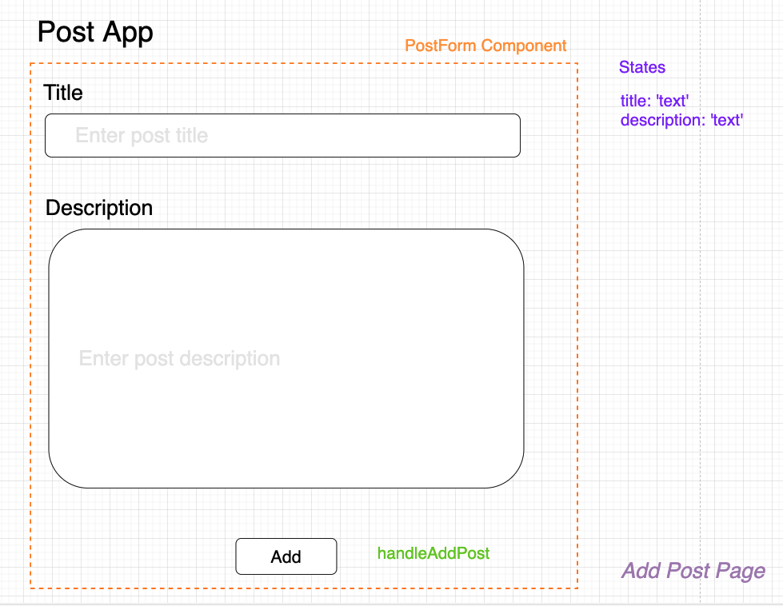

# Form Handling

ต่อมาเราจะสร้างหน้า Add Post Page


<br><hr><br>

## Building Form

ให้เราสร้าง UI หน้าตาให้คล้ายตัวแบบ code ตัวอย่างอยู่ด้านล่าง และในตัวอย่างนี้ เราจะเขียน style แบบ inline

```js
function AddPostPage() {
  return (
    <div className="postapp-add-post-container">
      <div className="postapp-header">
        <h1>Post App</h1>
      </div>

      <div
        style={{
          display: "flex",
          justifyContent: "center",
        }}
      >
        <form
          style={{
            display: "flex",
            flexDirection: "column",
            padding: 10,
            width: 600,
          }}
        >
          <div
            style={{
              display: "flex",
              flexDirection: "column",
            }}
          >
            <label htmlFor="title">Title</label>
            <input type="text" id="title" />
          </div>

          <div
            style={{
              display: "flex",
              flexDirection: "column",
              marginTop: 10,
            }}
          >
            <label htmlFor="description">Description</label>
            <textarea id="description" />
          </div>

          <div style={{ display: "flex", justifyContent: "center" }}>
            <button
              type="submit"
              style={{
                marginTop: 10,
                height: 40,
                width: 150,
              }}
            >
              Add
            </button>
          </div>
        </form>
      </div>
    </div>
  );
}

export default AddPostPage;
```

<br><hr><br>

## Handling Form States

ให้เราลองคิดดูหน่อยว่าเราจะออกแบบ Component หน้านี้อย่างไร ? จำรูปแบบการออกแบบสามข้อได้ไหมนะ ?

1. สิ่งนี้เรียกว่าอะไร ?
2. สิ่งนี้มี Functionalities อะไรบ้าง ?
3. ข้อมูลที่เกี่ยวข้องกับ Component นี้มีอะไรบ้าง (อะไรคือ States ?)



เมื่อเราเห็นภาพแล้วเรามาเริ่มสร้าง state variables เพื่อเก็บข้อมูลที่ user ใส่เข้ามากัน เรามี state สองตัวคือ title และ description

```js
import { useState } from 'react'

function AddPostPage() {
  const [title, setTitle] = useState('')
  const [description, setDescription] = useState('')

  // Rest of codes
```

จากนั้นเราจะเก็บ set states ที่ user กรอกเข้ามาจาก input ตัว input จะมี prop ท่ี่เรียกว่า onChange เมื่อ input มีการเปลี่ยนแปลง event handler function จะถูก call

🌟 Event Handler Function จะี parameter พิเศษเรียกว่า **Event Object** จะเป็น Object ที่เก็บข้อมูลเกี่ยวกับ Event นั้น ๆ

```js
import { useState } from 'react'

function AddPostPage() {
  const [title, setTitle] = useState('')
  const [description, setDescription] = useState('')

  function handleTitleChange(event) {

  }

  function handleDescriptionChange(event){

  }

  // Rest of codes
```

จากนั้น code ตรง input และ textarea เราจะใส่ function handleTitleChange และ handleDescriptionChange เข้าไปใน prop onChange ของแต่ละ input elements

```js
<input type="text" id="title" onChange={handleTitleChange} />
<textarea id="description" onChange={handleDescriptionChange} />
```

จากนั้นเราจะทำการ set ข้อมูลที่ user พิมพ์ลงไปเก็บไว้ใน state title และ description เราจะนำข้อมูลที่ user พิมพ์เข้ามามาจาก event object แบบนี้ `event.target.value` จากนั้นเราก็ส่งเข้าไปใน function `setTitle` และ `setDescription` ได้เลย

```js
import { useState } from 'react'

function AddPostPage() {
  const [title, setTitle] = useState('')
  const [description, setDescription] = useState('')

  function handleTitleChange(event) {
    setTitle(event.target.value)
  }

  function handleDescriptionChange(event){
    setDescription(event.target.value)
  }

  // Rest of codes
```

<br><hr><br>

## Form Submission

เราสามารถที่จะทำการ submit form ได้ด้วย การส่ง event handler function `handleSubmit` ที่เราสร้างขึ้นมใหม่ เข้าไปใน onSubmit prop ของตัว form element

```js
function AddPostPage() {
  // Skipped codes
  function handleSubmit(event) {
    event.preventDefault();
    // send data to server for creating post
  }
  // Skipped codes

```

🌟 สังเกต `event.preventDefault()` preventDefault เป็น function ที่ทำให้ behavior ปกติของการทำงานหลังจาก event นั้นเกิดขึ้นหยุดทำงาน เช่น เวลาเรากด submit form behavior ปกติคือ หน้าเว็บจะทำการ reload ทันที เพราะงั้นถ้าเรา preventDefault หน้าเว็บจะไม่ทำการ reload หลัง event submit เกิดขึ้น

หน้าตา form element

```js
 <form
    style={{
      display: "flex",
      flexDirection: "column",

      padding: 10,
      width: 600,
    }}
    onSubmit={handleSubmit}
  >
```

<br><hr><br>

## Creating Record On Server

เราจะทำการสร้าง function `createPosts` ขึ้นมาทำหน้าที่ request ไปหา server เพื่อทำการสร้าง post record

```js
async function createPosts(data) {
  let response = await fetch("http://localhost:8000/posts/", {
    method: "POST",
    body: JSON.stringify(data),
    headers: {
      "content-type": "application/json",
    },
  });

  if (response.ok) {
    console.log("response success");
  } else {
    console.log("Handle Response Not OK");
  }
}
```

จากนั้นให้เรียกใช้ `createPosts` ที่ `handleSubmit`

```js
function handleSubmit(event) {
  event.preventDefault();
  let data = {
    title: title,
    content: description,
  };
  createPosts(data);
}
```
