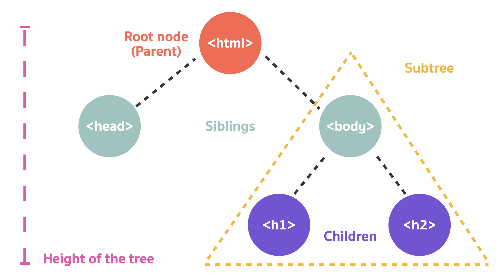

# Document Object Model (DOM)

HTML ประกอบไปด้วย Tags ต่าง ๆ แล้ว Tags มันจะถูกเก็บอยู่ในรูปแบบของ Object และพวก Objects พวกนี้มันจะก่อร่างสร้างตัวกันเป็นรูปแบบแบบหนึ่ง เราเรียกรูปแบบนี้ว่า **Document Object Model (DOM)**

JS จะสามารถ access DOM ได้ เช่น

```js
document.body.style.background = "cornflowerblue";
```

<br><hr><br>

## DOM Illustration

สมมุติว่าเรามี HTML Document อยู่ประมาณนี้

```html
<!DOCTYPE html>
<html>
  <head>
    <title>CODECAMP #8</title>
  </head>
  <body>
    <h1>WELCOME TO CODECAMP #8</h1>
    <h2>WELCOME TO CODECAMP #8</h2>
  </body>
</html>
```

จากโค้ดด้านบน เราสามารถวาดภาพของ DOM ออกมาเป็นรูปแบบนี้ได้



- html คือ **Root node** หรือเป็น **Parent** ของ Tag head และ body

- head และ body เป็น **Siblings** กัน

- h1 และ h2 เป็น **Children** ของ body

<br><hr><br>

## DOM Manipulation

จากตัวอย่าง Code

```html
<div id="news-feed-section">
  <div class="post">
    <h1 class="post-title">[1] Learning about DOM</h1>
    <p class="post-description">
      Lorem ipsum dolor sit amet, consectetur adipiscing elit. Suspendisse
      pellentesque venenatis dolor, nec faucibus diam consectetur in. Aenean
      suscipit a magna eget faucibus. In sed orci semper.
    </p>
  </div>
  <div class="post">
    <h1 class="post-title">[2] Learning about React</h1>
    <p class="post-description">
      Lorem ipsum dolor sit amet, consectetur adipiscing elit. Suspendisse
      pellentesque venenatis dolor, nec faucibus diam consectetur in. Aenean
      suscipit a magna eget faucibus. In sed orci semper.
    </p>
  </div>
</div>
```

เราสามารถที่จะจัดการ และแก้ไข DOM ได้ดังนี้

### Accessing DOM Elments

เราสามารถที่จะเลือก DOM Elements ได้หลายแบบ

```js
// เลือกจาก ID เราจะได้ div ที่มี ID เป็น news-feed-section มาเก็บไว้ใน variable newsFeedSection
let newsFeedSection = document.getElementById("news-feed-section");

// เลือกจาก Class Name เราจะได้ div ที่มี class เป็น post ใน variable posts
let posts = document.getElementsByClassName("post");

// เลือกจาก Class Name เราจะได้ div ที่มี class เป็น post-title ใน variable postTitle
let postTitle = document.querySelector(".post-title");
```

### Grab Children / Parent Nodes

เราสามารถที่จะเลือก Children หรือ Parent ของ Element นั้น ๆ ได้

```js
let newsFeedSection = document.getElementById("news-feed-section");

// เลือก Children ของ newsFeedSection
let posts = newsFeedSection.childNodes;

// เลือก Parent ของ post
posts = document.getElementsByClassName("post");

let firstPostParent = posts[0].parentNode;
```

### Create New DOM Elements

```js
// สร้าง element p ขึ้นมา
let newParagraph = document.createElement("p");

// ใส่ text เข้าไปใน element p
let paragraphText = document.createTextNode("This is a nice paragraph text!");

// ใส่ paragraphText เข้าไปใน newParagraph ซึ่งก็คือ element p
newParagraph.appendChild(paragraphText);
```

### Add Elements to the DOM

เราสามารถเอา Element ที่สร้างเข้าไปใส่ใน DOM ได้

```js
// สร้าง element p ขึ้นมา
let newParagraph = document.createElement("p");

// ใส่ text เข้าไปใน element p
newParagraph.textContent = "This is a nice paragraph text!";
newParagraph.style.color = "crimson";
newParagraph.style.fontSize = "50px";

// เลือก post element มา
let posts = document.getElementsByClassName("post");
let firstPost = posts[0];

// ทำการเพิ่ม p element เข้าไปใน firstPost
firstPost.appendChild(newParagraph);
```

### Add / Remove / Toggle / Check Classes

เราสามารถที่จะ modify class attribute ของ Element นั้น ๆ ได้ เพื่อทำให้ elements แสดงผลแตกต่างกันออกไปตาม css class

```js
// เลือก post element มา
let posts = document.getElementsByClassName("post");
let firstPost = posts[0];

//สามารถที่จะเพิ่ม class หรือ ลบ class ออกก็ได้
firstPost.classList.add("post-hidden");
firstPost.classList.remove("post-hidden");
firstPost.classList.toggle("post-hidden");
```

🌟 [DOM Manipulation Cheat Sheet](https://gist.github.com/thegitfather/9c9f1a927cd57df14a59c268f118ce86)

<br><hr><br>

## DOM Events

Events คือ **สัญญาณ** ที่บางอย่างได้เกิดขึ้น

ยกตัวอย่างเช่น

- **Mouse Events** เช่น Mouse Click, Mouse Over / Mouse Out, Mouse Down / Mouse Up, Mouse Move
- **Keyboard Events** เช่น Key Down / Key Up
- **Form Elements Events** เช่น Input focus, Form submission, Etc.

โดยปกติแล้ว Elements แต่ละตัวจะสามารถที่จะมี Action เวลาที่ Events ในบาง Events เกิดขึ้น เราจะเรียกสิ่งนั้นว่า **Event Handlers**

**Event Handlers สามารถเขียนได้ 3 แบบ**

1. **Method** `addEventListener` เป็นแบบที่ยืดหยุ่นมากที่สุด 🌟

```html
<button class="login-button">Login</button>

<script>
  let loginButton = document.querySelector(".login-button");

  loginButton.addEventListener("click", handleClick);

  function handleClick() {
    console.log("login !");
  }
</script>
```

2. **HTML Attributes**

```html
<button class="login-button" onclick="handleClick()">Login</button>
<script>
  let loginButton = document.querySelector(".login-button");

  function handleClick() {
    console.log("login !");
  }
</script>
```

3. **DOM Property** ไม่ค่อยยืดหยุดสามารถมีได้แค่ handler เดียว

```html
<button class="login-button">Login</button>
<script>
  let loginButton = document.querySelector(".login-button");

  loginButton.onclick = function () {
    console.log("login !");
  };
</script>
```

<br><hr><br>

## Exercises 🏅

A) ให้เพิ่ม Product item เข้าไปใน Cart

- ให้ Mock ข้อมูล Item ขึ้นมาได้เลย

HTML Code

```html
<div id="cart">
  <div class="product-item">
    <h3 class="product-title">Product Title: Xiao Mi Air Purifier</h3>
    <p class="product-description">
      Product Description: Lorem ipsum dolor sit amet, consectetur adipiscing
      elit. Suspendisse pellentesque venenatis dolor, nec faucibus diam
      consectetur in. Aenean suscipit a magna eget faucibus. In sed orci semper.
    </p>
    <div class="product-price">Product Price: 250 Baht</div>
  </div>
</div>
```

B) ให้เพิ่ม Button ขึ้นมา 1 ตัว ที่ทำหน้าที่ Add Product Item เข้าไปใน Cart

## Bonus 🏅

C) ให้เพิ่ม Button ขึ้นมา 1 ตัว ที่ทำหน้าที่ Remove Product Item ออกจาก Cart ในแต่ละชิ้น

D) ให้เพิ่ม Button ขึ้นมา 1 ตัว ที่ทำหน้าที่ Edit Product Title แต่ละชิ้นใน Cart

<br><hr><br>

[Table of Contents](https://github.com/napatwongchr/intro-to-react/blob/main/README.md)
