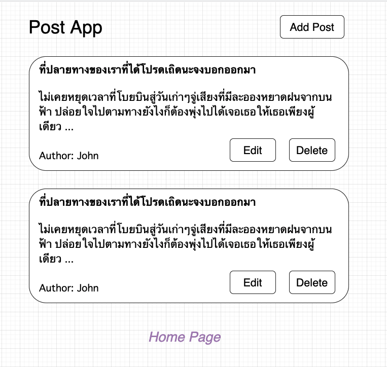
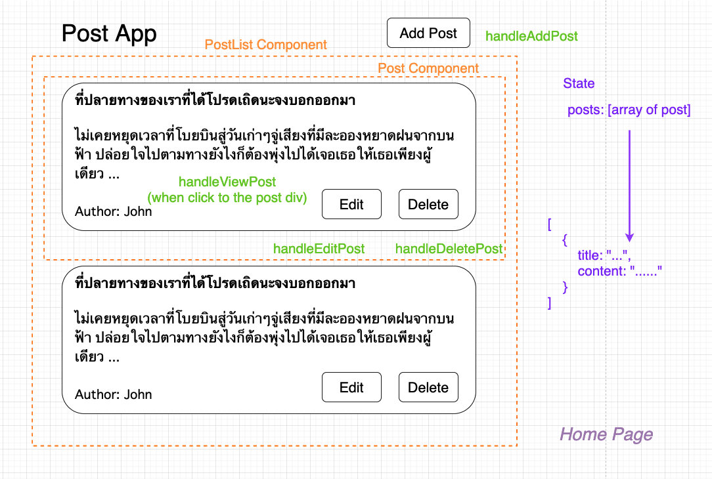

# Component Design

ต่อไปเราจะมาสร้าง Application ที่เรียกว่า Post App กัน เรามาลองดูภาพรวมของ App นี้กันก่อน

App ตัวนี้ประกอบไปด้วย

- หน้า Post List เป็นหน้าที่แสดงบทความทั้งหมด
- หน้า View Post เป็นหน้าที่แสดงบทความนั้น ๆ
- หน้า Add Post เป็นหน้าที่สามารถเขียน Post เพิ่มเข้าไปได้
- หน้า Update Post เป็นหน้าที่สามารถ Update Post นั้น ๆ ได้
- เราสามารถที่จะ Delete Post ได้

เราจะมาลองออกแบบหน้า Post List กัน

วิธีการออกแบบเบื้องต้น ให้เราลองคิด 3 อย่างนี้

**1. สิ่งนี้คืออะไร (Component)**

**2. สิ่งนี้ทำอะไร (Functionality)**

**3. มีข้อมูลอะไรที่เกี่ยวข้องกับสิ่งนี้บ้าง (State)**

จาก UI เรามาลองขยายความเพิ่มกันในแต่ละข้อกัน

**1. สิ่งนี้คืออะไร**

เราขอเรียกสิ่งนี้ว่าเป็น Post Home Page ที่ประกอบไปด้วย Post List และ Post พวกนี้แหล่ะคือ Component ของเรา (กรอบสีส้ม)

**2. สิ่งนี้ทำอะไร**

- Post Home Page เป็นหน้าที่แสดง Posts
- เราสามารถที่จะ Add Post ได้ด้วยการกด Add Post Button (handleAddPost)
- เราสามารถที่จะ Update Post ได้ด้วยการกด Edit Button (handleEditPost)
- เราสามารถที่จะ Delete Post ได้ด้วยการกด Delete Button (handleDeletePost)
- เราสามารถที่จะกดที่ Post เพื่อ View Post ได้ (handleViewPost)

**3. ข้อมูลที่เกี่ยวข้อง**

เนื่องจาก Post Home Page แสดง Posts โครงสร้างข้อมูลที่เราจะเก็บจะเป็น Array ของ Post Object ซึ่ง Post Object ประกอบไปด้วยข้อมูล title, content และอาจจะมี author, published_date และเราสามารถที่จะ Add, Edit, Delete Posts ได้ ดังนั้น Posts จึงเป็น State (สีม่วง) ใน App ของเรา
