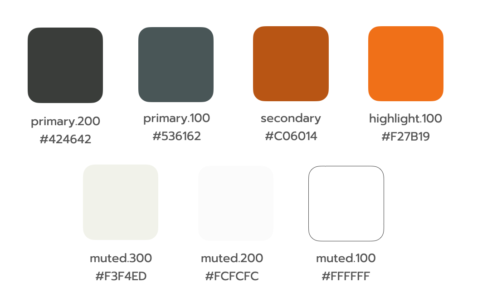

# Design System

A design system คือ Collection ของ Components ที่สามารถนำมา Reuse ใช้ใหม่ได้เรื่อย ๆ สิ่งที่สำคัญคือ **Components เหล่านี้ต้องมี standard ที่ชัด** ที่สามารถนำไป**ใช้สร้าง Products ได้ หลาย ๆ Products**

**ตัวอย่างของ Design System**

- [Google Material](https://material.io/)
- [Apple Human Interface](https://developer.apple.com/design/)
- [Microsoft Fluent Design System](https://www.microsoft.com/design/fluent/#/)
- [Vercel Design](https://vercel.com/design)
- Etc.

<br><hr><br>

## Why Design System

1. สามารถ**ตรวจสอบความถูกต้อง**ของหน้าตา Products ได้

2. สร้าง **Visual Design Language** ขึ้นมา - ตรงนี้เป็นประโยชน์มาก ๆ ทำให้ทีม Design / Developer ที่พัฒนา Products เห็นหน้าตาแบบเดียวกันได้ ในเรื่องของ สี, ตัวอักษร, ขนาด, หน้าตา Component ต่าง ๆ ที่อยู่บนเว็บ

เช่น [ตรงนี้สีฟ้า](https://upload.wikimedia.org/wikipedia/commons/thumb/b/bd/Color_icon_blue.svg/1200px-Color_icon_blue.svg.png) คิดว่าทุกคนจะมองเห็นเป็นสีฟ้าเดียวกันมั้ยนะ ?​

3. เป็นการ**สร้าง UI/pattern library**

4. มี **Design Document** ที่บอกว่า Component หน้าตาแบบนี้ใช้ยังไง ใช้ตอนไหนบ้าง

<br><hr><br>

## Start Building Design System With Chakra UI

สิ่งที่สำคัญเรื่องนึงในการสร้าง Design system คือ เรื่องของ **Theming** Chakra มีระบบ Theme ที่ดีมาก ๆ Customize ได้ไม่ยากซึ่งระบบ [Default Theme](https://chakra-ui.com/docs/theming/theme) ของ Chakra จะอ้างอิงจาก [Styled System Theme Specification](https://system-ui.com/theme/)

<br><hr><br>

## Theme Customizing

เนื่องจากว่าเวลาเราทำ App จริง ๆ เราต้องสร้าง App ที่มีรูปแบบหน้าตาเป็นของตัวเอง เราสามารถที่จะ Customize Theme Chakra ได้ 3 แบบใหญ่ ๆ

1. Theme Tokens
2. Component Styles
3. Global Styles

<br><hr><br>

## Theme Tokens

เราจะสร้าง Page เอาไว้สำหรับทำ Design System Document ของ Application เรา

ขั้นตอนแรกให้เราสร้าง Route ใหม่ขึ้นมา ใน `src/App.js`

จากนั้นเราจะไปสร้าง `DesignSystemPage` component ใน `src/pages/DesignSystem.js` แล้ว import เข้ามาใช้เพื่อ Link กับ route path

```js
import DesignSystemPage from "./pages/DesignSystemPage";

<Route path="/design-system" component={DesignSystemPage} />;
```

เราจะสร้าง folder `src/styles` ขึ้นมา แล้วสร้าง `theme.js` เอาไว้ข้างใน เราจะเรียกใช้ function extendTheme เพื่อ overide theme tokens

<br>

[ดูข้อมูลเพิ่มเติมเกี่ยวกับ theme tokens ที่สามารถ overide ได้ตรงนี้](https://github.com/chakra-ui/chakra-ui/tree/main/packages/theme/src/foundations)

```js
import { extendTheme } from "@chakra-ui/react";

export const theme = extendTheme({
  colors: {
    primary: {
      200: "#424642",
      100: "#536162",
    },
  },
});
```

จากนั้นให้เราเอา theme ไปใส่ใน ChakraProvider

```js
import { theme } from "./styles/theme";

<ChakraProvider theme={theme}>
  <App />
</ChakraProvider>;
```

จากนั้นให้เราลองเรียกใช้ใน DesignSystemPage component

```js
import { Box } from "@chakra-ui/react";

function DesignSystemPage() {
  return (
    <Box>
      <Box bg="primary.200" color="white" p="5" fontSize="2xl">
        App's Design System
      </Box>
      <Buttons />
    </Box>
  );
}
```

ซึ่ง Theme Tokens พวกนี้เราสามารถเอาจาก UX/UI Designer ของ Product เราได้เค้าจะมีหน้าตาแบบนี้มาให้



เราสามารถที่จะเขียน Theme Tokens ออกมาได้แบบนี้

```js
export const theme = extendTheme({
  colors: {
    text: "#424642",
    primary: {
      200: "#424642",
      100: "#536162",
    },
    secondary: "#C06014",
    highlight: {
      100: "#F27B19",
    },
    muted: {
      300: "#F3F4ED",
      200: "#FCFCFC",
      100: "#FFFFFF",
    },
  },
});
```

การกำหนด fonts ให้เราไปเลือก Fonts ที่ [Google Fonts](https://fonts.google.com/) จากนั้นให้เราเลือก Fonts มาแล้วเปิด link css ที่ Google แปะไว้ให้ จากนั้น Copy content มาใส่ใน ไฟล์ที่เราจะสร้างใหม่ชื่อ `src/styles/Fonts.js`

```js
import { Global } from "@emotion/react";

const Fonts = () => (
  <Global
    styles={`
      /* Copied from https://fonts.googleapis.com/css2?family=Prompt&display=swap */

      /* thai */
      @font-face {
        font-family: 'Prompt';
        font-style: normal;
        font-weight: 400;
        font-display: swap;
        src: url(https://fonts.gstatic.com/s/prompt/v4/-W__XJnvUD7dzB2KdNodREEje60k.woff2) format('woff2');
        unicode-range: U+0E01-0E5B, U+200C-200D, U+25CC;
      }
      /* vietnamese */
      @font-face {
        font-family: 'Prompt';
        font-style: normal;
        font-weight: 400;
        font-display: swap;
        src: url(https://fonts.gstatic.com/s/prompt/v4/-W__XJnvUD7dzB2Kb9odREEje60k.woff2) format('woff2');
        unicode-range: U+0102-0103, U+0110-0111, U+0128-0129, U+0168-0169, U+01A0-01A1, U+01AF-01B0, U+1EA0-1EF9, U+20AB;
      }
      /* latin-ext */
      @font-face {
        font-family: 'Prompt';
        font-style: normal;
        font-weight: 400;
        font-display: swap;
        src: url(https://fonts.gstatic.com/s/prompt/v4/-W__XJnvUD7dzB2KbtodREEje60k.woff2) format('woff2');
        unicode-range: U+0100-024F, U+0259, U+1E00-1EFF, U+2020, U+20A0-20AB, U+20AD-20CF, U+2113, U+2C60-2C7F, U+A720-A7FF;
      }
      /* latin */
      @font-face {
        font-family: 'Prompt';
        font-style: normal;
        font-weight: 400;
        font-display: swap;
        src: url(https://fonts.gstatic.com/s/prompt/v4/-W__XJnvUD7dzB2KYNodREEjew.woff2) format('woff2');
        unicode-range: U+0000-00FF, U+0131, U+0152-0153, U+02BB-02BC, U+02C6, U+02DA, U+02DC, U+2000-206F, U+2074, U+20AC, U+2122, U+2191, U+2193, U+2212, U+2215, U+FEFF, U+FFFD;
      }
    `}
  />
);

export default Fonts;
```

ต่อไปให้เราไปเรียกใช้ Fonts ที่ `src/index.js`

```js
<ChakraProvider theme={theme}>
  <Fonts />
  <App />
</ChakraProvider>
```

แล้วกำหนด theme token fonts

```js
export const theme = extendTheme({
  // Skipped code

  fonts: {
    heading: "Prompt",
    body: "Prompt",
  },

  // Skipped code
});
```

<br><hr><br>

## Global Styles

เราสามารถกำหนด Global Style ผ่าน theme.js ได้เลย

```js
const theme = extendTheme({
  styles: {
    global: {
      "html, body": {
        padding: 0,
        margin: 0,
        fontSize: "16px",
        color: "text",
      },
      "*": {
        boxSizing: "border-box",
      },
    },
  },
  // Skipped code
});
```

<br><hr><br>

## Component Styles

การ Style Chakra Component มี 2 แบบ

**1. Single Part Component**

**2. Multi Part Component**

เราต้องดูก่อนว่าเราสามารถ Style Chakra Component ไหนได้บ้างให้เรา[ดูได้ที่นี่](https://github.com/chakra-ui/chakra-ui/tree/main/packages/theme/src/components)

<br><hr><br>

## Styling Single Part Component

Single Part Component ยกตัวอย่างเช่น **Button**

การ Overide Component Style เราจะสร้าง Object ที่มี Key 4 ตัวคือ baseStyle, sizes, variant, และ defaultProps

```js
const Button = {
  baseStyle: {},
  sizes: {},
  variants: {},
  defaultProps: {},
};
```

เราจะสร้างไฟล์ Style Config ชื่อ `Button.js` ใน `src/styles/Button.js`

```js
const Button = {
  baseStyle: {
    fontWeight: "400",
  },
  sizes: {
    sm: {
      minWidth: "150px",
      fontSize: "sm",
      padding: "4",
    },
    md: {
      minWidth: "150px",
      fontSize: "md",
      padding: "6",
    },
    lg: { fontSize: "lg", padding: "8", minWidth: "150px" },
  },
  variants: {
    primary: {
      bg: "primary.200",
      color: "white",
      ":hover": {
        bg: "primary.100",
      },
      ":focus": {
        boxShadow: "none",
      },
    },
    secondary: {
      bg: "secondary",
      color: "white",
      ":hover": {
        bg: "highlight.100",
      },
      ":focus": {
        boxShadow: "none",
      },
    },
    outline: {
      bg: "muted.100",
      ":hover": {
        color: "white",
        bg: "highlight.100",
      },
      ":focus": {
        boxShadow: "none",
      },
    },
  },
  defaultProps: {
    size: "md",
    variant: "primary",
  },
};

export default Button;
```

จากนั้นเราจะ import ไปใส่ใน theme ของเราในไฟล์ `theme.js` ซึ่งใส่ตรง key `components` ใน object theme

```js
import Button from "./Button";

export const theme = extendTheme({
  // Skipped code
  components: {
    Button,
  },
});
```

## Styling Multi Parts Component

Multi Parts Component ยกตัวอย่างเช่น **Input**

การ Overide Component Style เราจะสร้าง Object ที่มี Key 5 ตัวคือ parts, baseStyle, sizes, variants, และ defaultProps

```js
const Input = {
  parts: [],
  baseStyle: {},
  sizes: {},
  variants: {},
  defaultProps: {},
};
```

เราจะสร้างไฟล์ Style Config ชื่อ `Input.js` ใน `src/styles/Input.js`

```js
const Input = {
  parts: ["field", "addon"],
  baseStyle: {},
  sizes: {},
  variants: {
    outline: {
      field: {
        bg: "white",
        color: "primary.200",
        borderColor: "primary.200",
        _hover: {
          borderColor: "primary.100",
        },
        _focus: {
          zIndex: 1,
          boxShadow: "0 0 0 1px #F27B19",
          borderColor: "secondary",
        },
      },
    },
    filled: {
      field: {
        border: "1px solid",
        _hover: {
          borderColor: "primary.100",
        },
        _focus: {
          zIndex: 1,
          boxShadow: "0 0 0 1px #F27B19",
          borderColor: "secondary",
        },
      },
    },
    flushed: {
      field: {
        _focus: {
          borderColor: "secondary",
          boxShadow: `0px 1px 0px 0px #F27B19`,
        },
      },
    },
  },
  defaultProps: {},
};

export default Input;
```

จากนั้นเราจะ import ไปใส่ใน theme ของเราในไฟล์ `theme.js` ซึ่งใส่ตรง key `components` ใน object theme

```js
import Button from "./Button";
import Input from "./Input";

export const theme = extendTheme({
  // Skipped code
  components: {
    Button,
    Input,
  },
});
```

<br><hr><br>
