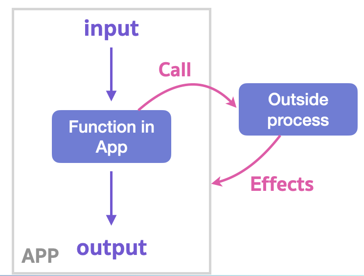
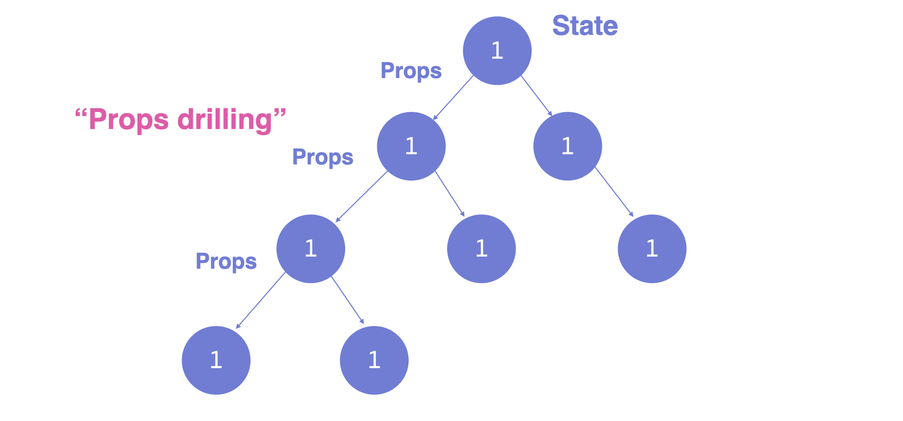
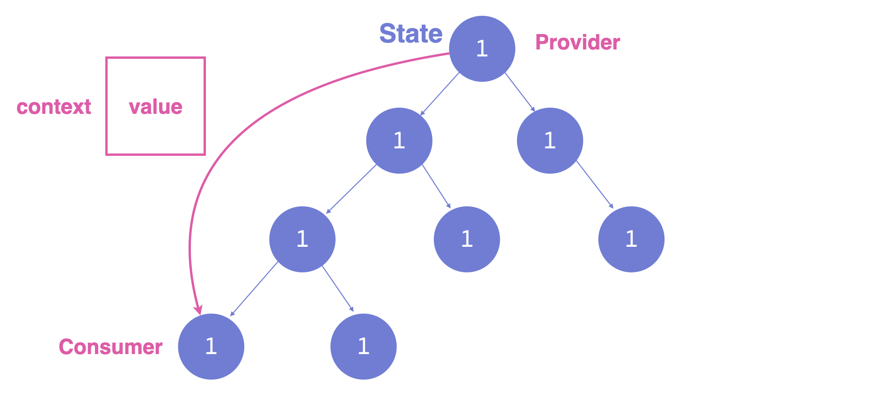

# React Hooks

React Hooks คือ function ที่ทำให้เราใช้ Feature ของ React ได้ใน Function component

<br><hr><br>

## Why React Hooks ?

React Team ออก Feature ตัวนี้มาด้วยเหตุผล 3 ข้อหลัก ๆ

**1. การ Reuse ใช้ Logic ระหว่าง Component**

ปกติแล้วเราจะใช้ Higher-order component (HOC) หรือ Render Props ในการ Reuse Logic ระหว่าง Components ซึ่งทำให้เกิด wrapper hell

**2. Component ที่ซับซ้อนมากๆ จะทำให้ยากต่อการทำความเข้าใจ**

การที่ใช้ Lifecycles methods ทำให้ Logic ต่างๆ กระจัดกระจายกันออกไปทำให้ดูยาก

**3. Class เป็นสิ่งที่ทำความเข้าใจยากต่อคน และคอมพิวเตอร์**

this เป็นสิ่งที่ทำความเข้าใจยาก และมีผลต่อกับ optimisation เวลา compile

<br><hr><br>

## State Hook

State Hook คือ function ที่ทำให้เราใส่ state เข้าไปใน Function component ได้

```js
import React, { useState } from "react";

function Counter() {
  const [counter, setCounter] = useState(0);
  return (
    <div>
      <h1>{counter}</h1>
      <button onClick={() => setCounter(counter + 1)}>Add</button>
      <button onClick={() => setCounter(counter - 1)}>Subtract</button>
    </div>
  );
}

export default Counter;
```

<br><hr><br>

## Effect Hook

Effect Hook คือ function ที่ทำให้เราทำ **Side effects** ได้ใน Function Component

**Side Effects** คือ การที่เราเปลี่ยน State ของโปรแกรมจากทางอ้อม เช่น เราเรียก Function นั้น ๆ แล้วได้ผลลัพธ์ แล้วเราได้ Effect นั้นกลับมาเมื่อไหร่ไม่รู้ แล้วมาเปลี่ยน State ของโปรแกรมของเรา



**ตัวอย่าง Side Effects**

- แก้ไข Variable ที่อยู่นอก Scope ตัวเอง (Ex. Global variable)
- Logging จาก console
- Network requests
- รัน process อื่น ๆ จากข้างนอก Application ของตัวเอง
- เขียนไฟล์
- Render Elements เข้าไปในหน้าเว็บ

ลองมาใช้ Effect Hook กัน

```js
import React, { useEffect } from "react";

function EffectCounter() {
  useEffect(() => {
    console.log("Run the side effect operations"); // Run ทุกครั้งที่ Component render
  });

  return (
    <div>
      <h1>0</h1>
    </div>
  );
}

export default EffectCounter;
```

### Array Dependency List

```js
useEffect(() => {
  console.log(‘Sync effect with ALL STATE’)
})
```

รันทุก ๆ ครั้งที่ Component render การที่ไม่ใส่ [] หมายความว่า Component จะ Sync กับทุก State ที่เปลี่่ยนแปลง

```js
useEffect(() => {
  console.log(‘Sync effect with NO STATE’)
}, [])
```

รันครั้งแรกที่ Component render เนื่องจากเราใส่ [] หมายความว่า มันไม่ต้อง Sync กับ State อะไรเลย

```js
useEffect(() => {
  console.log(‘Sync effect with THESE STATES')
}, [state1, state2, state3, stateEtc])
```

รันทุก ๆ ครั้งที่ state1 หรือ state2 หรือ state3 หรือ stateEtc เปลี่ยนแปลงใน Component

🌟 **จุดประสงค์ที่แท้จริงของ useEffect คือ การ Sync Side Effects เข้ากับ State ของ Application ของเรา**

<br><hr><br>

## Context Hook

โดยปกติแล้ว React จะมีปัญหาเรื่องของ **“Prop drilling”** คือ การที่เรามี Parent แล้วมี Child ที่ต้องการข้อมูลจาก Parent ห่างลงไปอีกหลาย ๆ ชั้นทำให้เราต้อง Pass props ลงไปผ่านทุก ๆ ชั้น



**React Context เกิดมาแก้ไขปัญหานี้** ทำให้เราเหมือนสร้างวาร์ปให้กับข้อมูลส่งไปให้ Child ที่อยู่ชั้นลึก ๆ ได้เลย​โดยไม่ต้องส่งผ่านมาเรื่อย ๆ



<br><hr><br>

## Reducer Hook

Reducer Hook คือ Redux แต่อยู่ในรูปแบบของ Hook **เราสามารถ Update state ผ่าน Action type ได้ มีประโยชน์เวลาต้องจัดการ State เยอะ ๆ ใน Component**


## Exercises 🏅

- [Click here !](https://github.com/napatwongchr/codecamp-hook-exercises)
