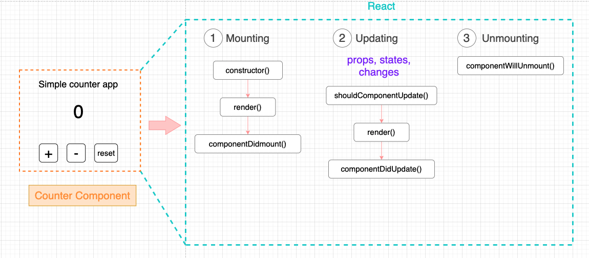

# React Component Lifecycles

Lifecycle คืออะไร ?​ ให้เรานึกถึง วงจรชีวิตของยุง เริ่มจาก ไข่ -> ลูกน้ำ -> ตัวโม่ง -> ยุงลาย ถูกมั้ยครับ 🦟 เช่นเดียวกันกับ React Component ซึ่งก็มี Lifecycle เช่นเดียวกัน เราลองมา zoom ดู Counter component กันสักหน่อย



**Component Lifecycle แบ่งออกเป็น 3 phase**

**1. Mounting Phase** เป็น Phase ที่จะเกิดขึ้นเมื่อ Component กำลังจะถูก mount เข้าไปใน DOM

- constructor method จะถูกรันก่อนเพื่อสร้าง component object
- ต่อมา render method จะถูกรันต่อเพื่อ render element เข้าไปใน DOM
- เมื่อ element ถูก render เข้าไปใน DOM เสร็จเรียบร้อยแล้ว React จะทำการ call `componentDidMount` method

**ใช้ตอนไหน ?**

- `componentDidMount` ใช้ตอนที่เราจะ fetch ข้อมูลจาก server

**2. Updating Phase** เป็น Phase ที่จะเกิดขึ้นเมื่อ props หรือ states เปลี่ยนแปลง

- `shouldComponentUpdate` จะถูก called และเป็นตัวที่ตัดสินใจว่า component นี้ควร update ไหม ? ถ้าไม่ให้ return false
- ต่อมา render method จะถูกรันต่อเพื่อ render element เข้าไปใน DOM
- `componentDidUpdate` จะถูก called หลังจาก component update

**ใช้ตอนไหน ?**

- `componentDidUpdate` ใช้เวลาทำการ request ข้อมูลจาก server (⚠️ ควร compare prevProps กับ props เสมอ ๆ ไม่งั้นจะติด Loop)

**3. Unmounting Phase** เป็น Phase ที่จะเกิดขึ้นเมื่อ Component ถูกลบออกจาก DOM

**ใช้ตอนไหน ?**

- ใช้เวลาเราต้องการ cancel network requests
- ใช้ clean subscriptions
- ใช้ clear ตัว set timer ต่าง ๆ เช่น serInterval()

<br><hr><br>

## ตัวอย่าง Component Lifecycles

```js
import React from "react";

class Counter extends React.Component {
  constructor(props) {
    super(props);
    this.state = {
      counter: 0,
    };
  }

  async componentDidMount() {
    console.log("Component did mount is called");
  }

  componentDidUpdate() {
    console.log("Component has been updated !");
  }

  componentWillUnmount() {
    console.log("Component will unmount is called !");
  }

  handleAddCounter = () => {
    this.setState(function (state) {
      return {
        counter: state.counter + 1,
      };
    });
  };

  handleSubtractCounter = () => {
    this.setState(function (state) {
      return {
        counter: state.counter - 1,
      };
    });
  };

  handleResetCounter = () => {
    this.setState(function (state) {
      return {
        counter: 0,
      };
    });
  };

  render() {
    return (
      <div>
        <h1>Counter: {this.state.counter}</h1>
        <button onClick={this.handleAddCounter}>Add</button>
        <button onClick={this.handleSubtractCounter}>Subtract</button>
        <button onClick={this.handleResetCounter}>Reset</button>
      </div>
    );
  }
}

export default Counter;
```

<br><hr><br>

[Table of Contents](https://github.com/napatwongchr/intro-to-react/blob/main/README.md)
