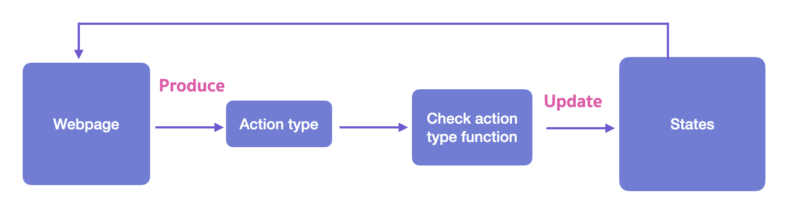

## Reducer Hook

Reducer Hook คือ Redux แต่อยู่ในรูปแบบของ Hook **เราสามารถ Update state ผ่าน Action type ได้ มีประโยชน์เวลาต้องจัดการ State เยอะ ๆ ใน Component**



ลองจัดการ state counter ด้วย useReducer ให้เรา import useReducer function เข้ามาก่อน

```js
import { useState, useReducer } from "react";

const INITIAL_STATE = {
  counter: 0,
};

// เรียกใช้ useReducer ใน Component
const [state, dispatch] = useReducer(counterReducer, INITIAL_STATE);
```

จากนั้นให้เราสร้าง `counterReducer` function

```js
function counterReducer(state, action) {
  switch (action.type) {
    case "increment":
      return { counter: state.counter + 1 };
    case "decrement":
      return { counter: state.counter - 1 };
    case "reset":
      return { counter: 0 };
    default:
      return state;
  }
}
```

ต่อไปให้เราเรียกใช้ variable state.counter มา render และเรียกใช้ dispatch function เพื่อที่จะ dispatch action ออกไปเพื่อเปลี่ยนแปลง state ตาม action นั้น ๆ

```js
<div>
  <h1>Counter page</h1>
  {toggle && (
    <Counter
      counter={state.counter}
      addCounter={() => dispatch({ type: "add_counter" })}
      subtractCounter={() => dispatch({ type: "subtract_counter" })}
      resetCounter={() => dispatch({ type: "reset_counter" })}
    />
  )}
  <h1>Show Counter: {state.counter}</h1>
  <button onClick={() => setToggle(!toggle)}>Toggle</button>
</div>
```

<br><hr><br>

[Table of Contents](https://github.com/napatwongchr/intro-to-react/blob/main/README.md)
